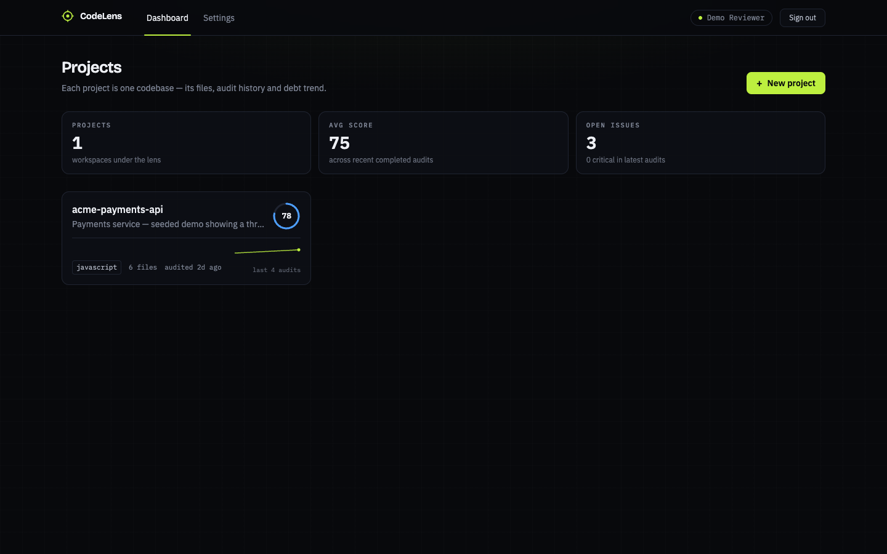
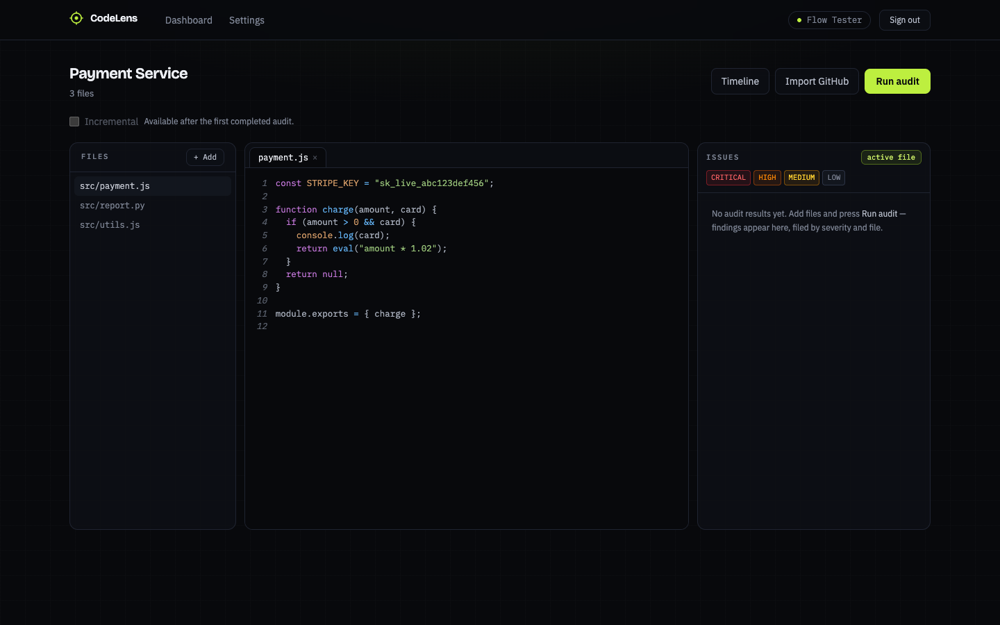
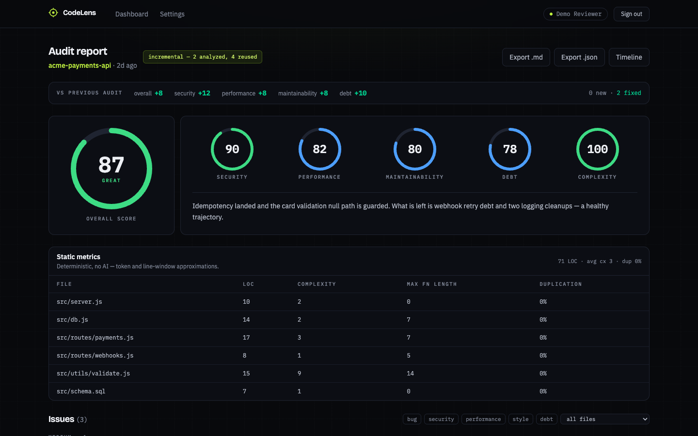
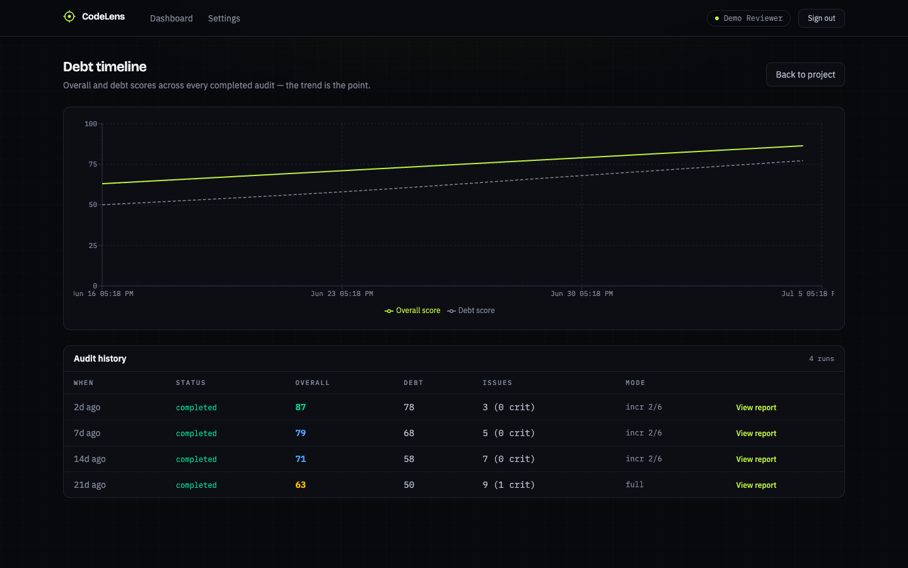

# CodeLens AI

AI code audit and technical-debt tracking platform — SonarQube + LLM energy on a free-tier stack. Create projects, add code (paste, upload, or GitHub repo import), run audits that combine **deterministic static metrics** with **Gemini LLM analysis**, get a weighted 0–100 score and per-file issue list, then fix, re-audit and watch the debt trend. Audits run asynchronously on a BullMQ/Redis queue, and re-audits are **incremental** — only changed files (content-hash diff) are re-analyzed.

| | |
|---|---|
|  |  |
|  |  |

## Architecture

```
┌──────────────┐        ┌───────────────────────────┐        ┌──────────────┐
│ React client │  HTTP  │ Express API (src/index.js)│ enqueue│ Redis        │
│ Vite + TW v4 ├───────►│ JWT auth · ownership      ├───────►│ BullMQ queue │
│ (Vercel)     │        │ checks · 202 + poll       │        │ (Upstash)    │
└──────────────┘        └─────────────┬─────────────┘        └──────┬───────┘
                                      │                             │ job
                          ┌───────────▼─────────────┐   ┌───────────▼──────────┐
                          │ PostgreSQL (Supabase)   │◄──┤ Worker (src/worker.js)│
                          │ User Project ProjectFile│ tx│ static metrics →     │
                          │ Audit Issue             │   │ Gemini → scoring     │
                          └─────────────────────────┘   └──────────────────────┘
```

Two server processes, one codebase: the API never runs audits inline and never imports the worker. The worker consumes `audits` jobs, computes static metrics for all files, calls Gemini for changed files only, and persists Issues + Audit scores + project debt score in **one Prisma transaction**.

## Quick start (local)

Prerequisites: Node 20+, PostgreSQL, Redis.

```bash
# server
cd server
npm install
cp .env.example .env        # fill in DATABASE_URL, JWT_SECRET, REDIS_URL, GEMINI_API_KEY
npx prisma db push          # creates tables
npm run dev                 # API on :3001

# worker (second terminal)
cd server && npm run worker

# client (third terminal)
cd client
npm install
cp .env.example .env        # VITE_API_URL=http://localhost:3001
npm run dev                 # app on :5173
```

**Demo mode (no Gemini key/quota):** set `GEMINI_API_KEY=demo`. Audits then use a deterministic heuristic scanner (eval usage, hardcoded credentials, TODOs, debug output) instead of the LLM — the full pipeline, queue, scoring and UI behave identically.

**Demo account:** `cd server && npm run seed` creates `demo@codelens.dev` / `codelens-demo` with a realistic project (`acme-payments-api`) and four backdated audits showing a three-week debt paydown (63 → 71 → 79 → 87) — the dashboard, timeline and diff views look alive immediately. Re-running the seed resets it.

## API

All routes except register/login/health require `Authorization: Bearer <JWT>` (7-day expiry). Project-scoped routes verify ownership and return **404** (not 403) on foreign resources to avoid enumeration. Register/login are rate-limited (30 req / 15 min per IP). Stored GitHub PATs are encrypted at rest with AES-256-GCM (key derived from `JWT_SECRET` — rotating it invalidates stored tokens). If Redis is unreachable, audit enqueue returns 503 and marks the audit row failed instead of leaving it orphaned.

| Method | Path | Behavior |
|---|---|---|
| POST | `/api/auth/register` | bcrypt(10), returns `{token, user}` 201 |
| POST | `/api/auth/login` | verify, `{token, user}`; wrong creds → 401 |
| GET | `/api/auth/me` | profile + `hasGithubToken` (PAT never echoed) |
| PATCH | `/api/auth/me` | update name / set / clear GitHub PAT |
| GET | `/api/projects` | user's projects + last 5 audit summaries |
| POST | `/api/projects` | create |
| GET | `/api/projects/:id` | project + file metadata (no content) + last 10 audits |
| PATCH | `/api/projects/:id` | update name/description |
| DELETE | `/api/projects/:id` | cascade delete |
| POST | `/api/projects/:id/files` | add `[{filename, content}]`; sha256 hash, language by extension, upsert on `(projectId, filename)` |
| GET | `/api/projects/:id/files/:fileId` | full content |
| PUT | `/api/projects/:id/files/:fileId` | replace content → recompute hash + lineCount |
| DELETE | `/api/projects/:id/files/:fileId` | delete |
| POST | `/api/projects/:id/github/import` | `{repoUrl, branch?}` → import repo (see below) |
| POST | `/api/projects/:id/audits` | **enqueue** audit (never inline). `{incremental?, trigger?}` → 202 `{auditId, jobId}` |
| GET | `/api/projects/:id/audits` | audit history (timeline) |
| GET | `/api/audits/:auditId` | status + scores + issues (poll target) |
| GET | `/api/audits/:auditId/diff` | deltas vs the previous completed audit: score changes + new/fixed issues |
| GET | `/api/audits/:auditId/markdown` | PR-comment markdown for CI |
| PATCH | `/api/issues/:issueId/resolve` | toggle resolved |
| GET | `/health` | 200, no auth |

## The audit engine

### 1. Static metrics (deterministic, no AI)

Per file: LOC (non-empty, non-comment), approximate cyclomatic complexity, max function length, duplication %.

> **Approximation disclaimer:** these are token/line-window heuristics, not AST analysis. Complexity = 1 + count of decision-point tokens (`if`, `for`, `while`, `case`, `catch`, `&&`, `||`, ternary `?`). Function length uses brace-depth tracking (`function`/`=> {`) and indent tracking (`def`). Duplication hashes sliding 6-line normalized windows — pooled across files, so cross-file copy-paste counts. Good enough to trend and to compare files; not a compiler.

Complexity score: `max(0, 100 − max(0, avgComplexity − 10) × 4) − duplicationPct × 0.5`, floored at 0.

### 2. Gemini analysis

`services/gemini.js` sends the codebase with a fixed audit prompt covering bugs / security / performance / style / debt and demands strict JSON. Hardening: code-fence stripping, one retry with a "JSON only" instruction, shape validation, score clamping to [0, 100], and batching when concatenated code exceeds ~80K chars (issues merged, scores LOC-weighted). Model: `gemini-1.5-flash` (override with `GEMINI_MODEL`).

### 3. Weighted scoring

Weights sum to exactly 1.0 (unit-tested):

```
overall = security×0.25 + performance×0.20 + maintainability×0.20
        + debt×0.15 + complexity×0.20        → clamped to [0, 100]
```

Score bands: 0–40 red · 41–70 amber · 71–85 blue · 86–100 green.

### Incremental audits

Each completed audit snapshots every file's `contentHash` inside `staticMetrics.perFile`. The next incremental audit diffs current hashes against that snapshot:

- **changed + new files** → re-analyzed by Gemini
- **unchanged files** → their unresolved issues are carried forward as fresh Issue rows; resolved ones stay resolved
- **all unchanged** → Gemini is skipped entirely; previous AI scores are reused
- static metrics are recomputed for all files every audit (cheap, deterministic)

The Audit row records `analyzedFileCount` / `reusedFileCount`, shown in the UI badge and PR comment.

## GitHub repo import

`POST /api/projects/:id/github/import` fetches the branch HEAD and recursive tree via Octokit (anonymous, or the user's PAT from Settings for private repos / higher rate limits). Filters: known code extensions only; skips `node_modules/`, `dist/`, `build/`, `vendor/`, `.min.`, lockfiles; skips blobs > 100 KB; caps at 50 files (largest first, remainder reported as `skipped`). Files upsert on `(projectId, filename)` with fresh hashes — **re-importing after new commits feeds the incremental audit path automatically**.

## Audit-on-PR GitHub Action

Copy `.github/workflows/codelens-audit.yml` into any target repo and set three secrets:

| Secret | Value |
|---|---|
| `CODELENS_API_URL` | your deployed API base URL |
| `CODELENS_TOKEN` | a JWT from `POST /api/auth/login` |
| `CODELENS_PROJECT_ID` | the CodeLens project linked to the repo |

On every PR it enqueues an incremental audit (`trigger: "ci"`), polls to completion and comments the score summary on the PR.

## Tests

```bash
cd server && npm test    # 122 tests: auth, CRUD/ownership, scoring, static
                         # metrics, Gemini hardening, incremental, GitHub
                         # import, PAT encryption, audit diff
```

Unit tests mock Prisma, the queue and the Gemini SDK — no live Postgres/Redis needed (CI runs them on every push/PR via `.github/workflows/ci.yml`). Queue/worker integration was additionally smoke-tested against local Postgres + Redis: enqueue → worker → completed audit with Issue rows, plus incremental and all-unchanged paths.

## Deployment

- **Database:** Supabase (free tier) → `DATABASE_URL`. Run `npx prisma db push` once.
- **Redis:** Upstash (free tier) → `REDIS_URL` (`rediss://…`). TLS is handled automatically (`maxRetriesPerRequest: null` + `rejectUnauthorized: false` are required by BullMQ/Upstash and already set).
- **API + worker on Railway:** either **two services** from the same repo (start commands `cd server && npm start` and `cd server && npm run worker`) or a single **Procfile**-based deploy (`web` + `worker` process types — see `Procfile`). Set all `server/.env.example` vars on both; set `CORS_ORIGIN` to your Vercel URL.
- **Client on Vercel:** root `client/`, framework Vite, env `VITE_API_URL` = Railway API URL.

## Environment variables

See `server/.env.example` (`DATABASE_URL`, `JWT_SECRET`, `GEMINI_API_KEY`, `GEMINI_MODEL`, `REDIS_URL`, `PORT`, `CORS_ORIGIN`) and `client/.env.example` (`VITE_API_URL`). Secrets live only in gitignored `.env` files / platform secret stores.

## Out of scope (intentionally)

Multi-user collaboration/sharing, issue comments, webhook auto-sync, payments/teams.
